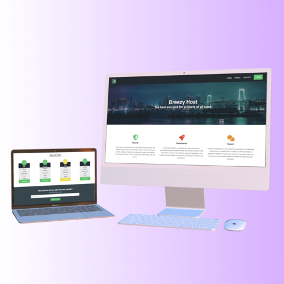

# Breezy Host

Breezy Host is a front-end project developed to simulate a web hosting service company. The website is built using HTML and CSS, featuring a fully responsive design suitable for mobile, tablet, small laptops, and desktop devices.

## Features

- **Navigation Bar**: Includes buttons for Home, Prices, Contact, and Login.
- **Sections**:
  - **Service Overview**: Brief descriptions of the company's security, performance, and support services.
  - **Plans and Prices**: Displays various hosting plans with their respective prices.
  - **Domain Search**: Allows users to search for available domains.
  - **Contact Form**: A section where users can send messages or inquiries.

## Responsiveness

The site is designed to be responsive, ensuring a consistent and accessible user experience across different device sizes:
- **Mobile**
- **Tablet**
- **Small Laptops**
- **Desktop**

## Future Enhancements

- Implement redirection for navbar buttons to their respective pages.
- Add backend functionality for the domain search and contact form.
- Improve the design and layout for enhanced user experience.

## Installation

To view the project locally:
1. Clone the repository:
   ```bash
   git clone https://github.com/oftheus/Breezy-Host.git
   ```
2. Open the `index.html` file in your preferred web browser.

## Contributing

Contributions are welcome! Feel free to submit a pull request or open an issue for any suggestions or improvements.



